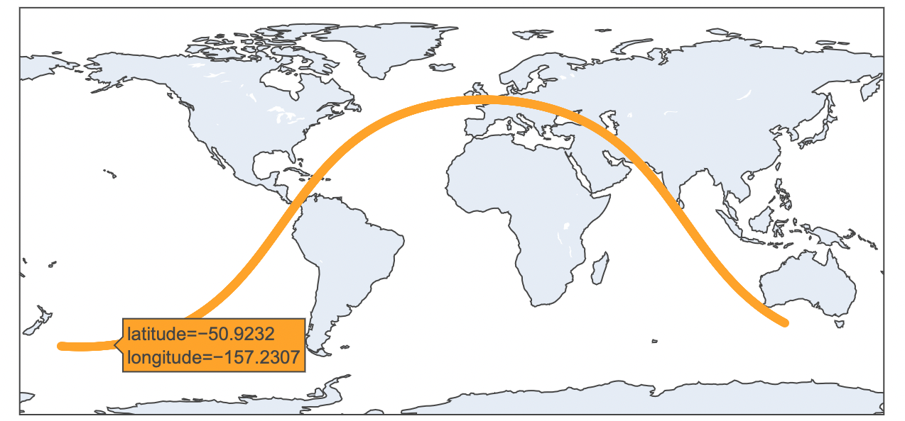
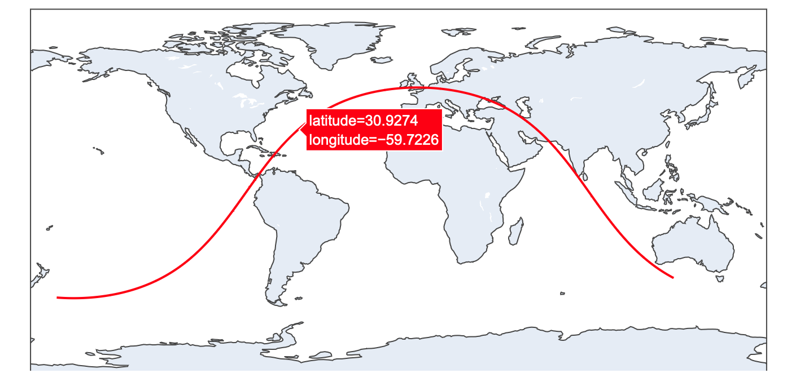

# Find ISS(International Space Station) Current  Location 

## What Is The International Space Station?

The International Space Station is a large spacecraft. It orbits around Earth. It is a home where astronauts live. The space station is also a science lab. Many countries worked together to build it. They also work together to use it. The space station is made of many pieces. The pieces were put together in space by astronauts. The space station's orbit is approximately 250 miles above Earth. NASA uses the station to learn about living and working in space. 

## About The Project
**In this project you can find the location and path it followed by International Space Station and see it on the map** 

### Prerequisites

* pandas 

    >pip install pandas

* **plotly.express**

    >conda install -c plotly plotly_express
    #### or
    > pip install plotly-express 

### Run 
just run the 'ISS_tracker.ipynb' and get the loction or Path of ISS 

### Screenshort 

