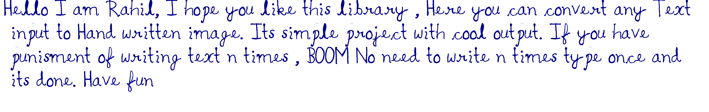

# Handwritten Text Generator

## About The Project

Here you can convert any Text input to Hand written image. It's simple project with cool output. If you have punisment of writing text n times , **BOOM!** No need to write **n** times **type once and its done**

## Getting Started 

### Prerequisites
* pywhatkit 5.0

    >pip install pywhatkit

    Open Terminal/cmd and type the above command and wait it to be completed 

### Run 
* Just run the 'text_to_handwritten.py' file 

## Read More

To read more about the PyWhatKit Python library click [here](https://pypi.org/project/pywhatkit/)

